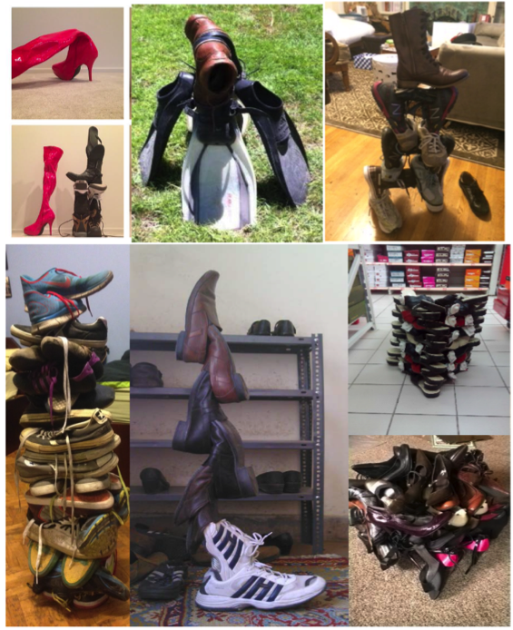

<center>

---
## Contents

1. Discover creativity
2. Stimulate creativity and collect ideas
3. Some interesting resutls

--- &radio

## Who has higher creativity?

Who has higher creativity?

1. Man
2. Woman
3. Engineer
4. Artist

*** .hint
Creativity Diversity

*** .explanation

--- 

## Discover creativity

Creativie Diversity：everyone is creative in different ways

<center>

---

## Discover creativity

1. Creative level
2. Creative style
3. Motive
4. Opportunity

---
## Stimulate creativity and collect ideas

1. Wild Mind
2. Idea Journal
3. Intelligent Fast Failure

---
## Introduction of data

<center>

---
## Statistical results

- Pearson Correlation:

1. between T-value and Attempt: 0.132 (p=0.001*)
2. between Number of shoes and Attemtp: -0.097 (p=0.005*)

```{r echo = F, results = 'asis', fig.width=6, fig.height=5, fig.align='center'}
nomissing <- read.csv("data/NoMissingWithCategory.csv", sep = ",")
allVars <-  as.data.frame(nomissing)
# summary(allVars$Attempt)
# plot(x = allVars$Attempt, y = allVars$TVALUE, data= subset(allVars, (Attempt<50 & TVALUE< 30)))
ggplot(data = subset(allVars, (Attempt<20 & TVALUE<20)), aes(x=TVALUE, y=Attempt)) +
  geom_point(aes(x=TVALUE, y = Attempt))
        # geom_vline(data=df2,aes(xintercept=YourScore), show.legend =TRUE) +
        # geom_histogram(position="identity", alpha=0.4, bins = 20) +
        # geom_vline(xintercept = df2$YourScore,linetype=c(1)) +
        # ylim(c(0, 70))

# ggplotly()
# n1 <- nPlot(Freq ~ Hair, group = 'Eye', type = 'multiBarChart',data = subset(haireye, Sex == 'Male'))
# n1$print('chart1')
```

---

## Statistical results

- The differences in **Creative outcome/T-value** between gender are not significantly different.

```{r echo = F, results = 'asis', fig.width=10,fig.height=7, fig.align="center"}
nomissing <- read.csv("data/NoMissingWithCategory.csv", sep = ",")
allVars <-  as.data.frame(nomissing)
allVars$Gender <- as.factor(allVars$Gender)
# summary(allVars$Gender)
ggplot(data = subset(allVars, TVALUE<20), aes(x = Gender, y=TVALUE)) +
  geom_boxplot(aes(x=Gender, y=TVALUE, fill=Gender))
```

---

## Statistical results

- The differences in **IFF/Attempt** between gender are not significantly different.

```{r echo = F, results = 'asis', fig.width=10,fig.height=7, fig.align="center"}
nomissing <- read.csv("data/NoMissingWithCategory.csv", sep = ",")
allVars <-  as.data.frame(nomissing)
allVars$Gender <- as.factor(allVars$Gender)
# summary(allVars$Gender)
ggplot(data = subset(allVars, Attempt<30), aes(x = Gender, y=Attempt)) +
  geom_boxplot(aes(x=Gender, y=Attempt, fill=Gender))
```

---

## Statistical results

- The differences in **Creative outcome/T-value** between countries are significantly different. 

```{r echo = F, results = 'asis', fig.width=10,fig.height=7, fig.align="center"}
nomissing <- read.csv("data/NoMissingWithCategory.csv", sep = ",")
allVars <-  as.data.frame(nomissing)
allVars$Gender <- as.factor(allVars$Gender)
# summary(allVars$Gender)
ggplot(data = subset(allVars, (TVALUE<20 & (Country==" Nigeria" | Country==" Mexico" | Country == " China"))), aes(x = Country, y = TVALUE)) +
  geom_boxplot(aes(x=Country, y=TVALUE, fill=Country))
```

---

## Statistical results

- The differences in **Attempt** between countries are significantly different. 

```{r echo = F, results = 'asis', fig.width=10,fig.height=7, fig.align="center"}
nomissing <- read.csv("data/NoMissingWithCategory.csv", sep = ",")
allVars <-  as.data.frame(nomissing)
allVars$Gender <- as.factor(allVars$Gender)
# summary(allVars$Gender)
ggplot(data = subset(allVars, (Attempt<16 & (Country==" Spain" | Country==" Nigeria" | Country==" Mexico" | Country == " China"))), aes(x = Country, y = Attempt)) +
  geom_boxplot(aes(x=Country, y=Attempt, fill=Country))
```

---

## Online application and products

1. [Creative style online estimation](http://ameveryone.com/shiny/Creativity/)
2. [R package: DataClean](https://cran.r-project.org/web/packages/DataClean/)

<center>

---

## Recommended courses:
1. [Creativity, Innovation and Changes -- Penn State University](https://www.coursera.org/learn/creativity-innovation)
2. [Machine Learning -- Stanford University](https://www.coursera.org/learn/machine-learning/home/info)
3. [Developing Data Products -- The Johns Hopkins University](https://www.coursera.org/learn/data-products/home/welcome) 