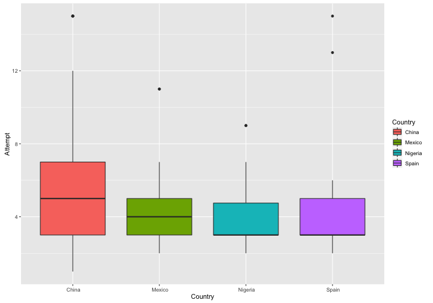

---
## Contents

1. Discover creativity
2. Stimulate creativity and collect ideas
3. Some interesting resutls

--- &radio

## Who has higher creativity?

Who has higher creativity?

1. Man
2. Woman
3. Engineer
4. Artist

*** .hint
Creativity Diversity

*** .explanation

--- 

## Discover creativity

Creativie Diversity：everyone is creative in different ways

---

## Discover creativity

1. Creative level
2. Creative style
3. Motive
4. Opportunity

---
## Stimulate creativity and collect ideas

1. Wild Mind
2. Idea Journal
3. Intelligent Fast Failure

---
## Introduction of data

---
## Statistical results

- Pearson Correlation:

1. between T-value and Attempt: 0.132 (p=0.001*)
2. between Number of shoes and Attemtp: -0.097 (p=0.005*)

---

## Statistical results

- The differences in **Creative outcome/T-value** between gender are not significantly different.

---

## Statistical results

- The differences in **IFF/Attempt** between gender are not significantly different.

---

## Statistical results

- The differences in **Creative outcome/T-value** between countries are significantly different. 

---

## Statistical results

- The differences in **Attempt** between countries are significantly different. 

---

## Online application and products

1. [Creative style online estimation](http://ameveryone.com/shiny/Creativity/)
2. [R package: DataClean](https://cran.r-project.org/web/packages/DataClean/)

---

## Recommended courses:
1. [Creativity, Innovation and Changes -- Penn State University](https://www.coursera.org/learn/creativity-innovation)
2. [Machine Learning -- Stanford University](https://www.coursera.org/learn/machine-learning/home/info)
3. [Developing Data Products -- The Johns Hopkins University](https://www.coursera.org/learn/data-products/home/welcome) 
