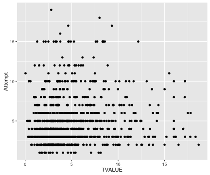

## 目录

1. 大数据时代所需技能
2. 创造力的发现与重建
3. 相关研究结果展示

--- .class #id

## 大数据，所需技能

1. 批判性思维
2. 跨学科合作能力
3. 数据驱动的科研能力
4. 创造力！

--- &radio

## 小调查

什么样的人创造力更高？

1. 男人
2. 女人
3. 工程师
4. 艺术家

*** .hint
创造力有很多种

*** .explanation
解释参考来自于上一页

--- 

## 发现创造力

创造力多样性：任何人都有创造力

{:width="200px"}

---
## 发现创造力

1. 不同创造力水平
2. 创造力类型
3. 动机
4. 机遇

---
## 放大创造力

1. Wild Mind
2. Idea Journal
3. Intelligent Fast Failure

---
## 统计分析结果展示

- 相关性

Pearson Correlation between T-value and Attempts: 0.132 (p=0.001*)

---
## 统计分析结果展示

- 智能快速失败在男、女间并无统计显著区别

---
## 统计分析结果展示

- 智能快速失败在国家间有显著区别

